# Retail Analytics & Product Recommendation System  
Turning Transaction Data into Actionable Business Intelligence

---

## Project Overview

This project analyzes real-world retail transaction data to extract meaningful business insights and build a product recommendation system. The objective is to help e-commerce businesses understand customer behavior, optimize product performance, and improve revenue through data-driven decision-making.

The project combines:
- Exploratory Data Analysis (EDA)
- Customer segmentation (RFM analysis)
- Product performance analysis
- Time-based sales trends
- Product recommendation system

---

## Business Problem

E-commerce businesses often struggle with:

- Understanding customer purchasing behavior  
- Identifying high-value customers  
- Improving product discovery  
- Increasing cross-selling opportunities  
- Reducing product returns  

This project addresses these challenges using data analytics and recommendation techniques.

---

## 1. Data Quality Assessment

Before analysis, data quality was evaluated to ensure reliability.

### Missing Values Analysis

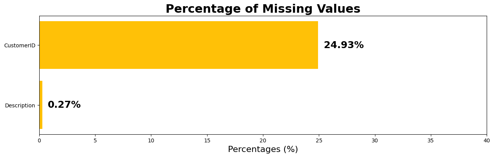

This visualization shows the percentage of missing values in each column. It helps identify data completeness issues and informs preprocessing decisions.

---

### Outliers vs Inliers

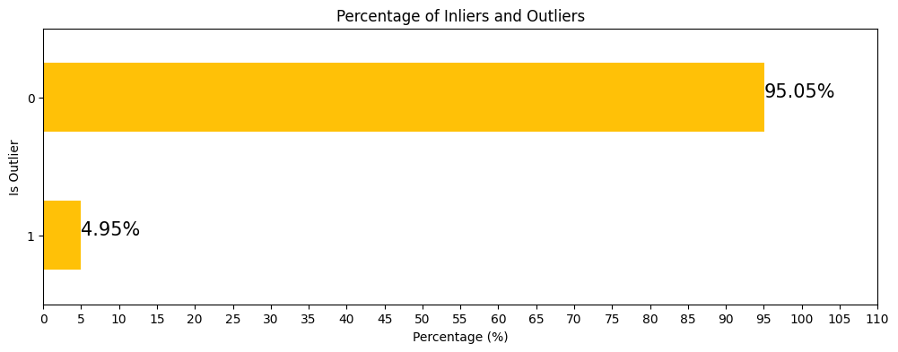

This chart shows the distribution of inliers and outliers in the dataset. Outliers were analyzed carefully as they can significantly affect revenue and customer behavior insights.

---

### Stock Code Frequency

This visualization highlights the most frequently occurring stock codes, helping identify high-demand or frequently purchased products.

---

## 2. Customer Analytics

This section focuses on understanding customer behavior and segmentation.

---

### Customer Segmentation (RFM Analysis)

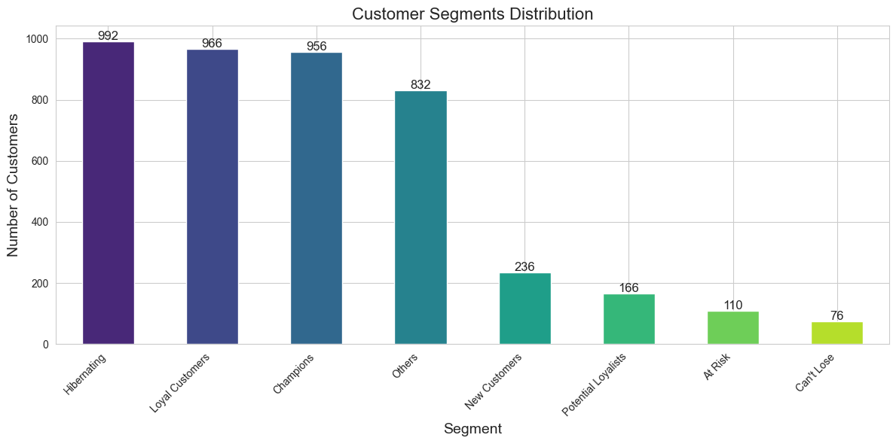

Customers are grouped based on Recency, Frequency, and Monetary value. This segmentation helps identify:
- Loyal customers  
- At-risk customers  
- High-value customers  

---

### Top Customers by Order Frequency

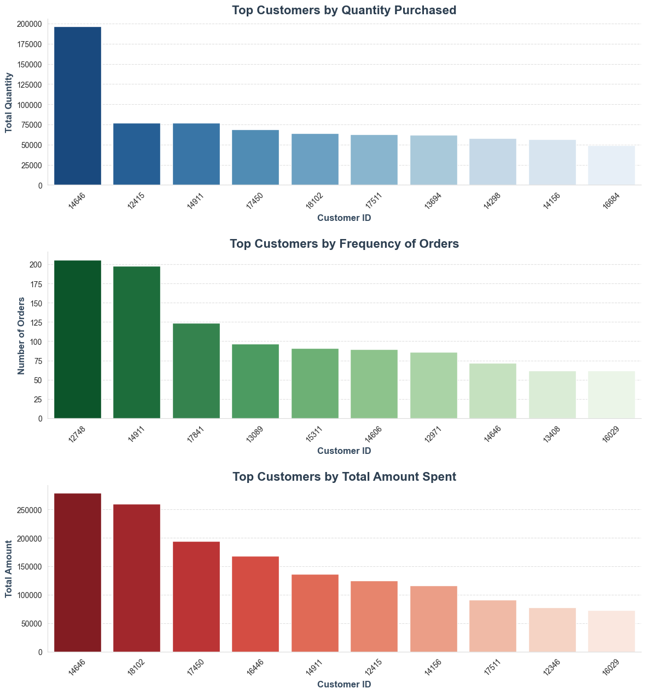

This visualization highlights customers with the highest number of orders. These customers are critical for retention strategies and loyalty programs.

---

### Top Countries by Orders

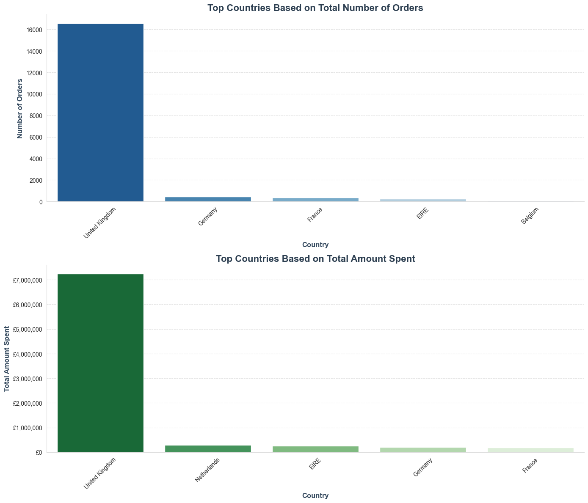

This chart shows geographic distribution of orders, helping identify key markets and expansion opportunities.

---

### RFM Metrics Distribution

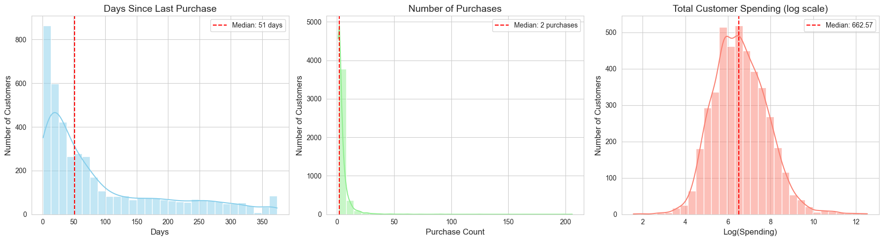

These histograms show the distribution of Recency, Frequency, and Monetary values. They help understand overall customer behavior patterns.

---

### Average Spending by Recency and Frequency

This analysis shows how customer spending varies with engagement level. It helps identify high-value customer behavior patterns.

---

## 3. Product Performance Analysis

This section evaluates product performance and revenue contribution.

---

### Top Products by Orders

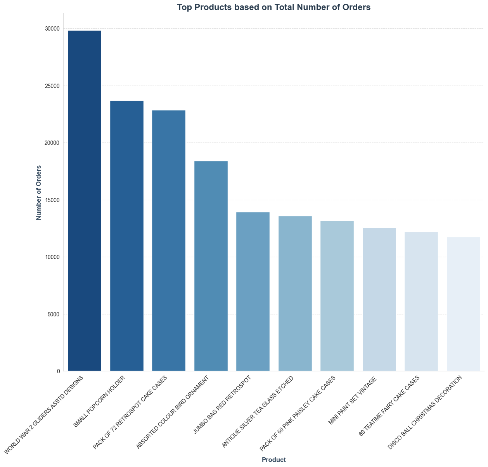

This visualization highlights the most frequently purchased products, indicating strong demand items.

---

### Revenue Driver Products

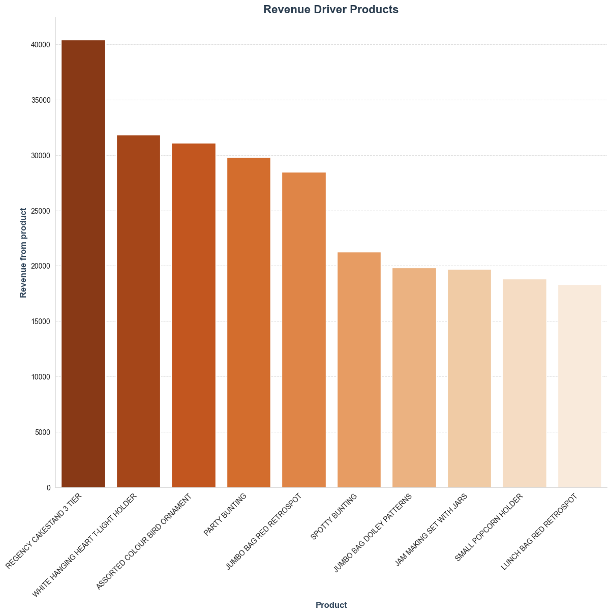

This chart shows products contributing the highest revenue. These are critical for business profitability and inventory planning.

---

### Return-Prone Products

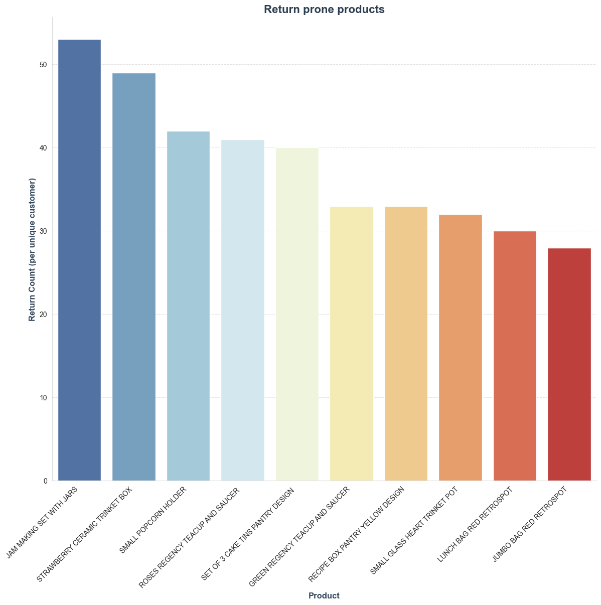

This visualization identifies products with high return rates. These items may require quality improvement or pricing adjustments.

---

## 4. Product Recommendation System

A recommendation system was built to improve product discovery and increase cross-selling opportunities.

---

### Market Basket Analysis (Product Associations)

This analysis identifies products frequently purchased together. It helps generate "Customers also bought" style recommendations and supports product bundling strategies.

---

### Product Association Rules

This visualization shows strong relationships between products based on co-purchase behavior. These insights are useful for cross-selling and upselling strategies.

---

### Recommendation Logic

A basic collaborative filtering approach was applied:

- Customers with similar purchase behavior are identified  
- Products liked by similar customers are recommended  
- Helps in personalized product suggestions  

---

## 5. Sales Trend Analysis

Understanding time-based trends helps optimize business planning.

---

### Monthly Sales Trends

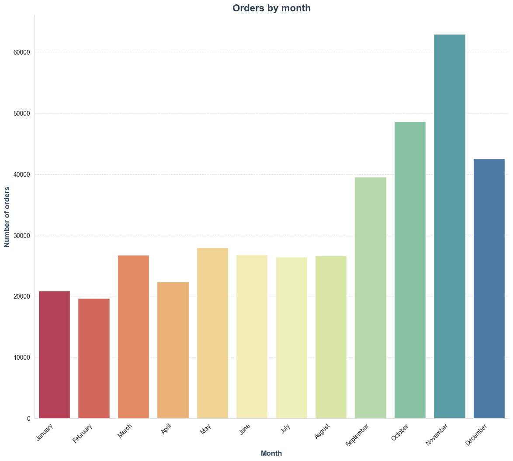

This visualization shows how sales evolve over time, helping identify seasonal demand patterns.

---

### Sales by Day of the Week

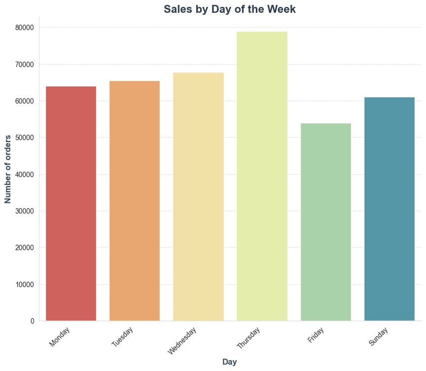

This chart identifies which days generate the highest sales, useful for campaign planning and promotions.

---

### Sales by Hour of the Day

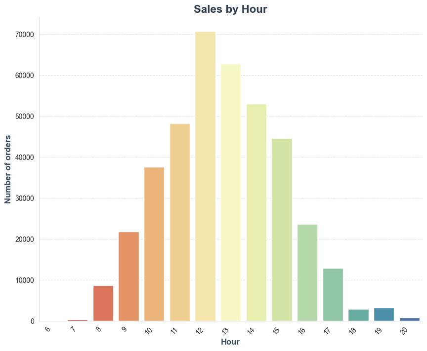

This visualization shows peak shopping hours, helping optimize marketing timing and operational planning.

---

## Key Business Insights

- A small number of products generate most of the revenue  
- Customer segmentation reveals clear behavioral patterns  
- Repeat customers contribute significantly to total sales  
- Sales vary strongly by time (monthly, weekly, hourly trends)  
- Certain products have high return rates and need attention  
- Product associations enable effective cross-selling strategies  

---

## Business Value

This project demonstrates real-world data analytics capabilities:

- Customer segmentation and retention analysis  
- Product performance optimization  
- Revenue driver identification  
- Recommendation system design  
- Time-based sales forecasting insights  

It directly reflects skills required in data analyst roles and freelance analytics projects.

---

## Tools & Technologies

- Python  
- Pandas, NumPy  
- Matplotlib, Seaborn  
- Scikit-learn  
- MLxtend (Association Rules)  
- RFM Analysis Techniques  

---

## 👤 Author

Rabail Shafeeq
Data Analyst | Python | Machine Learning | Business Intelligence  
